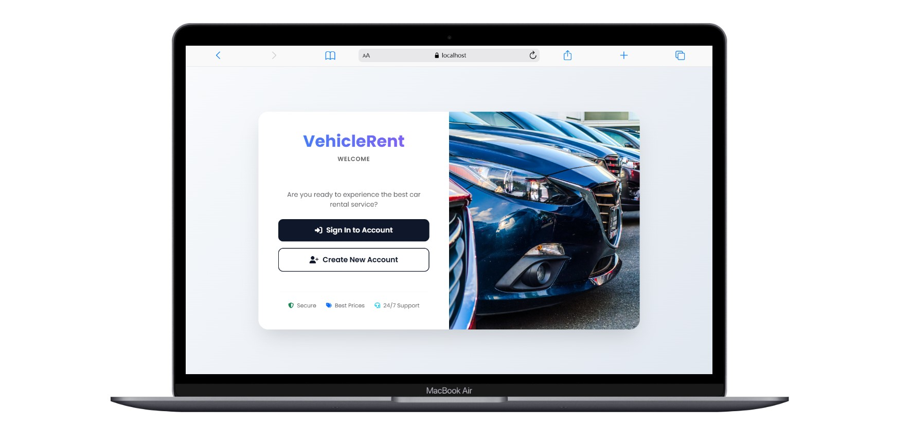
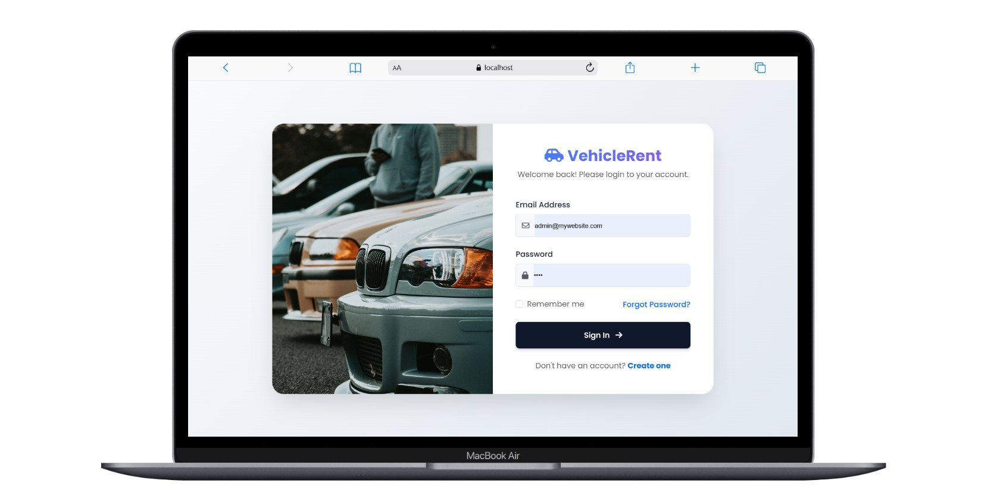
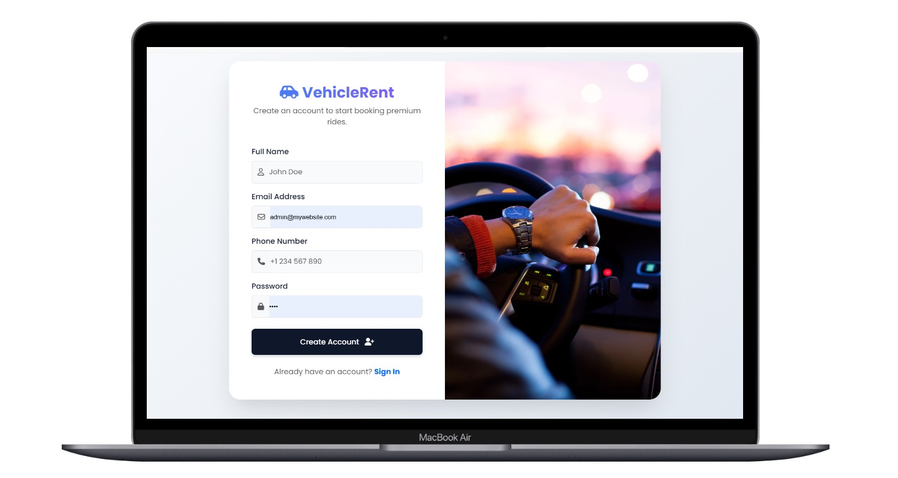
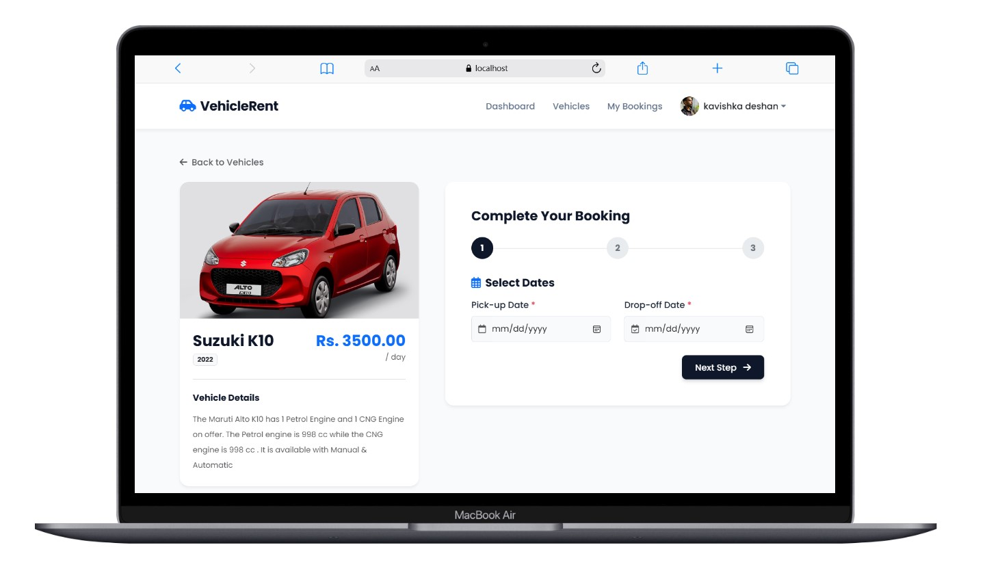
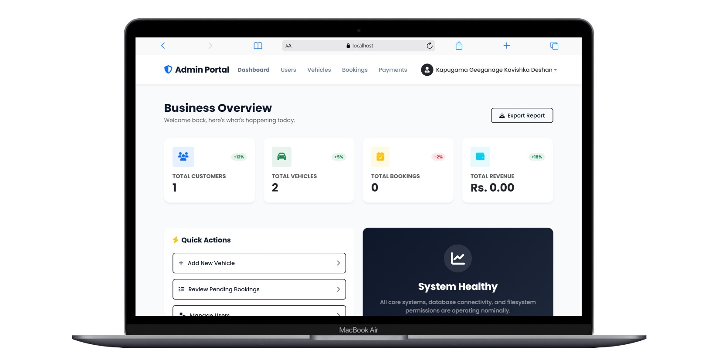
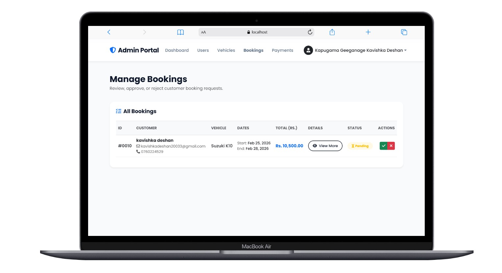

# 🚗 Premium Vehicle Rental System

## 📌 Project Overview
The **Premium Vehicle Rental System** is a comprehensive web-based platform designed to streamline the process of renting vehicles. It provides an intuitive interface for customers to browse, filter, and book vehicles, while offering administrators a powerful dashboard to manage the fleet, track bookings, and handle customer data securely.

---

## 📸 Screenshots

### 1. Landing / Customer Home


### 2. User Authentication (Login / Register)



### 3. Multi-Step Booking Process


### 4. Admin Dashboard Overview


### 5. Admin Viewing Booking Details


---

## 🛠️ Technologies Used

| **Technology**  | **Usage**  |
|----------------|-----------|
| **Frontend**  | HTML, CSS (Custom & Bootstrap 5), JavaScript |
| **Backend**   | PHP (Core PHP/Procedural & Object-Oriented) |
| **Database**  | MySQL |
| **Authentication** | PHP Sessions |
| **Server Engine** | Apache (via XAMPP) |

---

## 🎨 User Interfaces
The project consists of multiple user interfaces tailored for specific roles.

👤 **Customer Dashboard:**
- Browse available fleet with dynamic search and filtering.
- Prevent double-bookings with active booking constraints.
- Secure multi-step checkout process for booking vehicles.
- Upload required documents (Driving License) securely.
- Track active and historical bookings.

📊 **Admin Panel:**
- Manage user accounts.
- Add, update, hide, or remove vehicles from the fleet.
- Review detailed customer booking requests.
- Approve or reject pending bookings.
- Track payments and fleet status.

---

## ✅ Key Features & Functional Requirements

1️⃣ **User Management** – Role-based access control (Admin vs Customer).<br>
2️⃣ **Advanced Booking System** – Multi-step booking form collecting ride dates, contact info, destination, and document uploads.<br>
3️⃣ **Smart Fleet Management** – Real-time availability tracking; vehicles are locked when booked and freed when completed.<br>
4️⃣ **Double-Booking Protection** – System intuitively disables booking options for users who already have an active reservation for a specific vehicle.<br>
5️⃣ **Secure Authentication** – Encrypted passwords using PHP `password_hash()` and session-based access control.<br>
6️⃣ **Rich Admin Dashboard** – Features detailed modals for viewing customer trip requirements without cluttering the UI.<br>

---

## 🚀 Getting Started (Local Setup Guide)
To run this project locally on your machine, follow these steps using **XAMPP**.

### 1️⃣ Prerequisites
- Download and install [XAMPP](https://www.apachefriends.org/index.html) (Make sure it includes PHP 8.0+ and MySQL).
- Git installed on your system.

### 2️⃣ Clone the Repository
Open your terminal and navigate to your XAMPP `htdocs` directory.
- **Windows:** `C:\xampp\htdocs`
- **Mac:** `/Applications/XAMPP/xamppfiles/htdocs`
- **Linux:** `/opt/lampp/htdocs`

```sh
cd C:\xampp\htdocs
git clone https://github.com/your-username/vehicle-rental-system.git vehicle-rent
cd vehicle-rent
```

### 3️⃣ Database Setup (MySQL)
1. Open XAMPP Control Panel and start **Apache** and **MySQL**.
2. Open your browser and go to `http://localhost/phpmyadmin`.
3. Click on **New** to create a new database.
4. Name the database **`vehicle_rent_system`** and click Create.
5. Import the SQL file:
   - Click on the newly created `vehicle_rent_system` database on the left panel.
   - Click the **Import** tab at the top.
   - Click **Choose File** and select the `database.sql` file (if you export one) OR manually run the table creation scripts if you have them documented. 
   *(Note for Developer: Make sure to export your current database from phpMyAdmin to a file named `vehicle_rent_system.sql` and include it in your repo!)*

### 4️⃣ Configure the Environment
Ensure that the `config.php` file in the root directory contains the correct database credentials:
```php
<?php
$host = "localhost";
$db_user = "root"; // Default XAMPP user
$db_pass = "";     // Default XAMPP password (empty)
$db_name = "vehicle_rent_system";

$conn = new mysqli($host, $db_user, $db_pass, $db_name);
if ($conn->connect_error) { die("Connection failed: " . $conn->connect_error); }
?>
```

### 5️⃣ Run the Project
- Open your browser and visit: `http://localhost/vehicle-rent`

---

## 📂 Folder Structure Guideline
For a clean GitHub repository, organize your files like this:
```
vehicle-rent/
│
├── admin/               # Admin panel scripts (manage vehicles, bookings, etc.)
├── assets/              # CSS, JS, and static images
├── customer/            # Customer dashboard and booking logic
├── uploads/             # Ignored via git; where user profile pics and licenses go
├── config.php           # Database connection file
├── index.php            # Landing page
├── login.php            # Authentication
├── register.php         # Authentication
├── README.md            # This documentation file
└── vehicle_rent_system.sql # Exported database file
```

*(Make sure to create a `.gitignore` file and add `uploads/` to it so user data isn't pushed to GitHub!)*

---

## 📜 License
This project is open-source under the **MIT License**.
